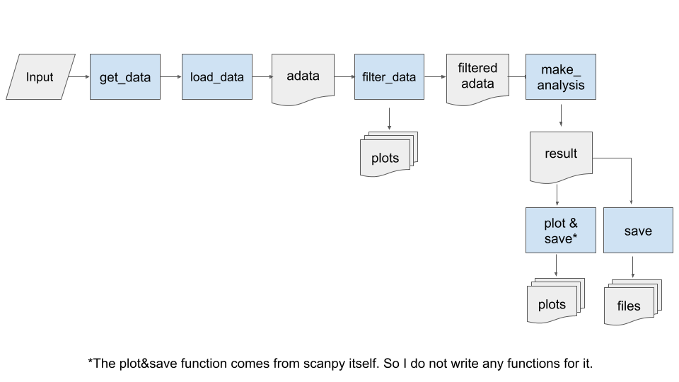

# easySC.py

## Description

This app aims for producing preliminary profiles of single cell data. It only supports 10X format at this moment.

## Usage

- `eashSC.py [-h] --data input`
- input: a folder contains three files: `barcodes.tsv.gz`, `features.tsv.gz`, and `matrix.mtx.gz`.

## Updates

## Discussion

- Please use `issue` in github to create issue and discussion.

## Test data

- `wget https://cf.10xgenomics.com/samples/cell-exp/4.0.0/SC3_v3_NextGem_SI_PBMC_10K/SC3_v3_NextGem_SI_PBMC_10K_raw_feature_bc_matrix.tar.gz`

## Workflow

- 
